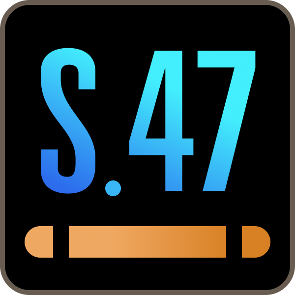

  

# System 47
Welcome to the official release repository for **System 47** on GitHub. 

This repository is used to host downloads, track bugs, and distribute test builds for the System 47 Screensaver and companion Viewer programs.

## Available Programs:
* **System 47 Screensaver** (Windows)
* **System 47 Viewer** (Windows)
* **System 47 Viewer** (Mac)

## Downloads
* Versions released in 2021-2022, visit this **[Release](../../releases/tag/v2.5.1)** page.
* Latest test build (July 7, 2026), please visit this **[Test Release](../../releases/tag/v2.5.2-test1)** page.

## Bug Reports
If you encounter any issues (such as the black screen bug), please check the [Issues](../../issues) tab to report it or see if a test build is available with a fix.

---
🧡**Built with Love** [Support my projects on Patreon](https://patreon.com/mewho) • [Ko-Fi](https://ko-fi.com/system47) \
💬**Stay connected** [Bluesky](https://bsky.app/profile/mewho-rob.bsky.social) | [Facebook](https://www.facebook.com/mewhoRob/) | [Mastodon](https://mastodon.social/@mewho) | [Discord](https://discord.gg/SnRdmSmnjK)

Cheers🖖 ~ meWho•Rob