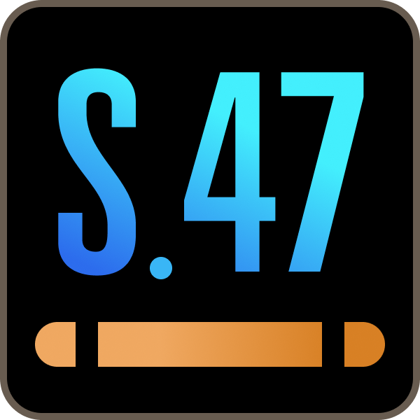
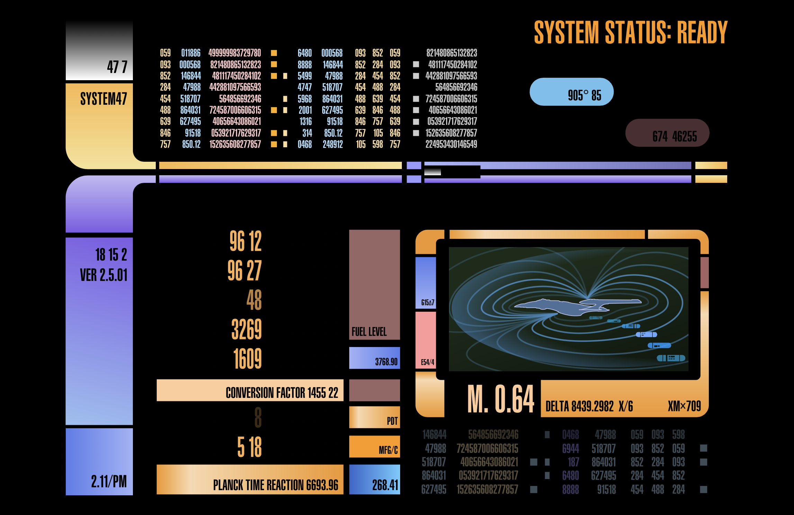

# System 47

Official downloads and issue tracking for System 47.

## Downloads

- Earlier releases: [version 2.5.1](../../releases/tag/v2.5.1)
- Current test release: [2.5.2 test 3](../../releases/tag/v2.5.2-test3)
- **macOS 27:** [System 47 2.5.02](../../releases/tag/v2.5.02-macos27)

## System 47 2.5.02 for macOS 27

<em>Original System 47 LCARS artwork and animation by meWho.</em>

System 47 2.5.02 is a lightweight screen-saver-style background app. It uses
Ruffle to run meWho’s preserved System 47 Viewer 2.5.01 content without Adobe
Flash.

It deliberately does **not** use Apple’s legacy third-party screen-saver host,
which does not reliably support System 47’s Web/Ruffle animation on current
macOS. This avoids the black/static screen and unwanted login behavior found
during testing.

### Compatibility

- macOS 15 or later
- Apple Silicon and Intel universal binaries
- Multiple displays with independently selected starting programs

### Installation

1. Download `System47-2.5.02-FINAL-macOS27-universal.zip` from the
   [release page](../../releases/tag/v2.5.02-macos27).
2. Unzip it and double-click `Install System 47.command`.
3. If macOS blocks it, Control-click it, choose **Open**, and confirm. If
   necessary, use **System Settings → Privacy & Security → Open Anyway**.
4. Choose a standard **Start after** interval, sound, and the starting program
   for each display. **20 minutes** is the default; **Never** disables automatic
   starting. Click **Save**.
5. For conflict-free use, set Apple’s separate screen saver to **Never** in
   **System Settings → Wallpaper → Screen Saver**. The installer does not
   silently change that Apple setting.

The installer adds a lightweight per-user background process that starts at
login. It does not change Apple’s screen-saver timer, Hot Corners, display
sleep, password, or Lock Screen settings.

### Using System 47

- **Automatic:** starts after the interval selected in System 47 Settings.
- **Manual:** hold the pointer at the **top center** of any display for three
  seconds.
- **Stop:** move the pointer, click, scroll, or press a key.
- **Optional login:** enable **Go to the macOS login screen when System 47
  closes** if desired. It is off by default.
- Click the **47** menu-bar icon for **Settings**, **Start Now**, or **Quit**.
- Opening **System 47.app** also opens Settings. Its temporary Dock icon
  disappears when the Settings window closes.
- Finder and the temporary Dock item use the included System 47 application
  icon.

### Troubleshooting

- **System 47 and Apple’s saver both start:** set Apple’s saver to Never.
- **Top-center hold does nothing:** hold at the very top edge, centered, for a
  full three seconds. Rerun the installer if necessary.
- **Automatic start does nothing:** select a non-Never interval and click Save.
- **System 47 will not close:** move the pointer distinctly, click, scroll, or
  press a key.
- **Unwanted sound:** clear the sound checkbox and click Save.
- **Installer blocked:** use Control-click **Open** or **Privacy & Security →
  Open Anyway**. Only approve the official release.
- **More help:** open an issue with the Mac model, macOS version, expected and
  actual behavior, and `~/Library/Logs/System47Launcher.log`.

SHA-256: `b36565f85505f3ddb1b821a3e57a6562947d3a5b107f57db2faf5659c5ff1355`

## Original work and attribution

**System 47 is the original creative work of meWho.** meWho created the
original program, LCARS artwork and interface, animations, sounds, and SWF
content. Space images are courtesy NASA/JPL-Caltech. We did not create or claim
authorship of that art, animation, audio, or original program content.

artistpro, LLC and Mike Lawson adapted meWho’s existing free work for current
macOS by replacing the obsolete projector runtime and adding universal macOS
rendering, multi-monitor settings, idle monitoring, and manual launch. This
adaptation is free of charge and provided as is, without warranty.

Visit [mewho.com/system47](https://www.mewho.com/system47/) for the original
releases and to support future System 47 development.

---

🧡 **Support meWho:** [Patreon](https://patreon.com/mewho) · [Ko-Fi](https://ko-fi.com/system47)  
💬 **Connect:** [Bluesky](https://bsky.app/profile/mewho-rob.bsky.social) · [Facebook](https://www.facebook.com/mewhoRob/) · [Mastodon](https://mastodon.social/@mewho) · [Discord](https://discord.gg/SnRdmSmnjK)
